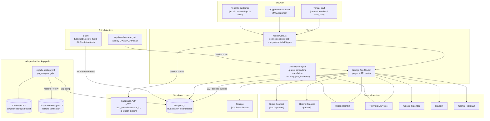

  

<h1 align="center">System Description</h1>

QCypher Technologies &middot; Internal Documentation

 

What QCypher actually is, how it's put together, and where the security
boundaries are — written for an auditor or a new engineer, grounded in
the real code as of 2026-08-16, not an aspirational diagram.

## What it is

QCypher is a multi-tenant SaaS CRM + website builder for local service
businesses (plumbers, cleaners, rental/equipment companies, etc.). Each
signed-up business is a **tenant**; each tenant's own customers are
**contacts**. Tenants manage jobs/orders, invoicing, a customer-facing
portal, loyalty/referrals, and their own public marketing site through
the same app.

## Monorepo layout

pnpm workspace (`pnpm-workspace.yaml`: `apps/*`, `packages/*`):

- `apps/web` — the entire product: Next.js 14 App Router, all UI, all
  API routes, cron jobs, tests.
- `packages/db` — shared database types/utilities.
- `packages/ui` — shared UI components.
- `packages/landing` — marketing-site-specific pieces.

There is exactly one deployable app. "Production" and "the app" both
mean `apps/web` on Vercel.

## Tech stack

| Layer | Technology |
|---|---|
| Frontend/backend | Next.js 14 (App Router), TypeScript, React |
| Hosting | Vercel (edge + serverless functions, cron scheduler) |
| Database | Supabase (managed PostgreSQL) |
| Auth | Supabase Auth — email/password, Google OAuth, magic link; TOTP MFA mandatory for super admins |
| File storage | Supabase Storage — one bucket in active use: `job-photos` |
| Backups | Independent nightly `pg_dump` → Cloudflare R2 (separate from Supabase's own managed backups) |
| Email | Resend |
| SMS/Voice | Telnyx |
| Payments | Stripe Connect (live/primary), Helcim Connect (built, intentionally paused) |
| Calendar integrations | Google Calendar, Cal.com (tenant-level OAuth connections) |
| AI | Google Gemini (one feature only — monthly report narration; app works fully without it) |
| CI/CD | GitHub Actions — no automated deploy pipeline; deploys are manual (`vercel --prod`) |

## Architecture diagram

## Data flow

1. A tenant staff member signs in (password, Google OAuth, or magic
   link). Supabase Auth issues a JWT carrying `app_metadata.tenant_id`
   and, for QCypher's own staff, `app_metadata.is_super_admin`.
2. `middleware.ts` validates the session cookie on every request. Public
   routes (marketing pages, auth pages, cron endpoints, webhooks,
   customer-facing portal/invoice/quote links) bypass this check —
   everything else requires a valid session. Super admins additionally
   need a completed MFA challenge (session AAL2) before any protected
   route resolves.
3. Application code queries Postgres through the Supabase client SDK
   using the caller's JWT. **Row-Level Security is the actual isolation
   boundary** — every tenant-scoped table filters on
   `tenant_id = public.tenant_id()`, a function reading the JWT claim.
   The app's own code does not additionally filter by tenant; RLS is
   trusted to do it, and is adversarially tested (see
   `apps/web/src/__tests__/isolation/`, 8 suites / 91 tests, blocking in
   CI as of 2026-08-16).
4. 10 daily cron jobs (Vercel's scheduler, listed in `vercel.json`)
   handle everything from audit-log purging to recurring-job scheduling
   to incident detection — see the table in `docs/gap-assessment.md` /
   the diagram above for the full list.
5. A fully independent path (GitHub Actions, not the app) backs up the
   database nightly to Cloudflare R2 and verifies both the backup and a
   real restore, separate from whatever Supabase's own managed backups
   do.

## Security boundaries

- **Tenant A cannot see Tenant B's data** — enforced by Postgres RLS,
  not application logic. This is the single most important boundary in
  the system and the one most directly tested (see Data flow #3).
- **Regular tenant staff cannot reach super-admin functions** — enforced
  by both RLS (`public.is_super_admin()`) and route-level checks; role
  within a tenant (`owner`/`member`/`read_only`) is a separate,
  lower-stakes boundary enforced the same way.
- **Super-admin accounts require MFA** — the only account tier with
  cross-tenant read access; enforced in `middleware.ts` regardless of
  which sign-in method was used.
- **`service_role` (bypasses RLS entirely) is used in exactly two kinds
  of places**: server-side API routes that legitimately need
  cross-tenant provisioning (e.g., tenant/invite creation), and one-off
  admin scripts under `scripts/`. It is never sent to the client and
  `scripts/secret-audit.sh` checks for that in CI (currently
  non-blocking — see `docs/change-management-policy.md`).
- **API routes are cookie-session-only, not a public API surface.**
  `/api/admin/*` and `/api/send` reject any request without a valid
  browser session cookie (a raw Bearer token is not sufficient) —
  confirmed directly while building the RLS test suite. Webhook routes
  (`/api/webhooks/*`) are the deliberate exception, authenticated by
  provider-specific signature/token checks instead of a session.

## Known documentation debt

`packages/db/migrations/` is a **stale, no-longer-used** migration
directory — its newest file predates the currently-active
`supabase/migrations/` (date-prefixed) directory by about two weeks, and
nothing has been added to it since. Keeping both around risks someone
(human or AI) trusting the wrong one as ground truth for what schema is
actually live — this already happened once this session (see
`docs/risk-register.md` Risk #4). It should be deleted or clearly marked
deprecated; left as-is for now since removing it wasn't in scope for
this pass.

## Review cadence

Reviewed whenever the architecture changes meaningfully (new external
integration, new deploy target, new data store) — this is a snapshot,
not a living diagram that updates itself, so treat any inconsistency
with the actual code as the code being right.
